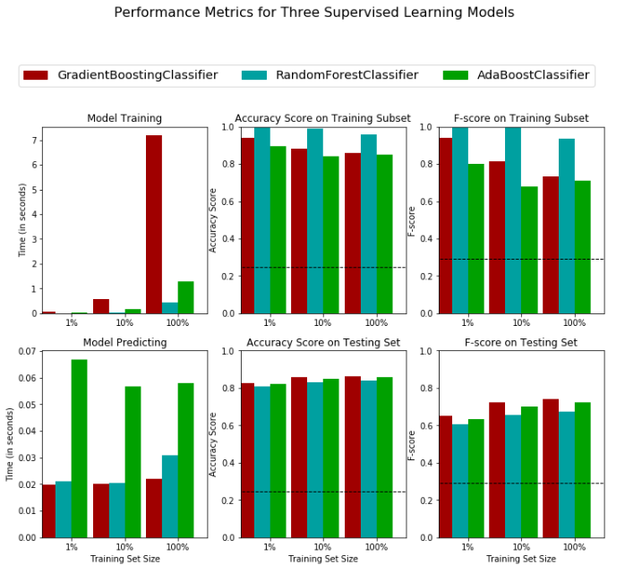

# Finding Donors for CharityML
CharityML is a fictitious charity organization located in the heart of Silicon Valley that was established to provide financial support for people eager to learn machine learning. After nearly 32,000 letters were sent to people in the community, CharityML determined that every donation they received came from someone that was making more than $50,000 annually. To expand their potential donor base, CharityML has decided to send letters to residents of California, but to only those most likely to donate to the charity. With nearly 15 million working Californians, CharityML has brought us on board to help build an algorithm to best identify potential donors and reduce overhead cost of sending mail. Our goal will be evaluate and optimize several different supervised learners to determine which algorithm will provide the highest donation yield while also reducing the total number of letters being sent.

## Project Description
In this project, first we have trained three ensemble methods to predict potential donors for CharityML
	1. Gradient Boosting
	1. Random Forest
	1. AdaBoost
We have found that Gradient Boosting gave better performance for testing dataset in terms of prediction time, accuracy and F score. 
	
Later, we have optimised the Gradient Boosting model by Grid Search method. The final optimised method gives the following results:
** Accuracy and F Score **
|     Metric     | Unoptimized Model | Optimized Model |
| :------------: | :---------------: | :-------------: | 
| Accuracy Score |     0.8630        |   0.8718        |
| F-score        |     0.7395        |   0.7553        |
** Confusion Matrix **
|                    | Predicted_Income<=50K | Predicted_Income>50K |
| :----------------: | :-------------------: | :------------------: | 
| Actual_Income<=50K |        6454           |         386          |
| Actual_Income>50K  |        774            |        1431          |
Finally we have identified five important features of our optimised model and trained a final model with reduced features.
** Accuracy and F Score **
|     Metric     | Optimized Model with full features | Optimized Model with reduced features |
| :------------: | :--------------------------------: | :-----------------------------------: | 
| Accuracy Score |               0.8718               |                 0.8589                |
| F-score        |               0.7553               |                 0.7255                |

